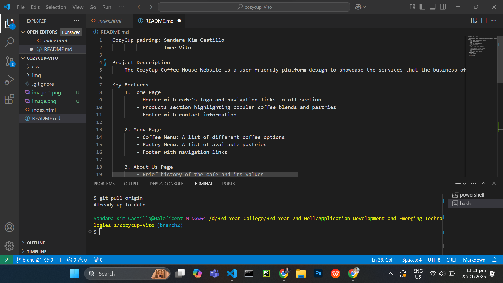
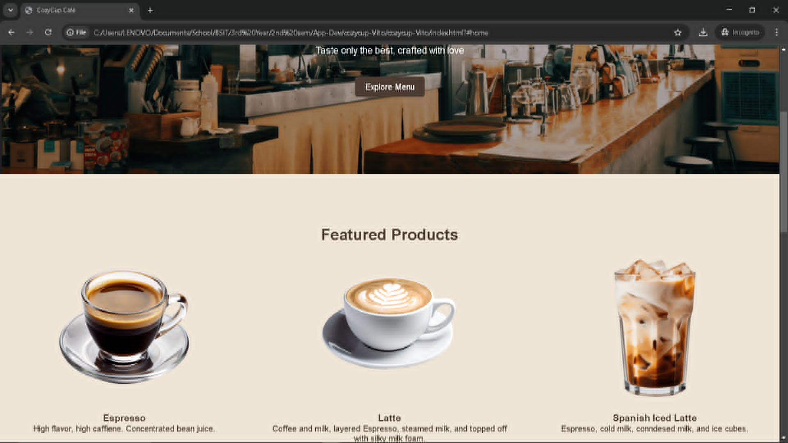

## CozyCup pairing: Sandara Kim Castillo, Imee Vito

**Project Description**
    The CozyCup Coffee House Website is a user-friendly platform design to showcase the services that the business offer while allowing customers to explore the menu, learn about the cafe and contact the business easily.

**Key Features**

*Home Page*
+ Header with cafe's logo and navigation links to all section
+ Products section highlighting popular coffee blends and pastries
+ Footer with contact information
    
*Menu Page*
+ Coffee Menu: A list of different coffee options
+ Pastry Menu: A list of available pastries
+ Footer with navigation links
    
*About Us Page*
+ Brief history of the cafe and its values
+ Photos and short bios of the cafe owner and staff
+ Cafe's mission
    
*Contact Page*
+ Contact Information: Cafe Address, Phone No., and Email
+ Contact Form: A form for visitors to send inquiries, feedback, or reservation requests
+ Map: An embedded map showing the café's location

*Footer*
+ Quick links to Home, Menu, About Us, and Contact Pages
+ Social Media icons with links to profiles

**CONTACT INFORMATION**
    For any issues or questions about this project, please contact:
Email: ***cozy_cup@gmail.com***

**Screen Captures**

    This captures the creation of the readme file.
     

    This is the created home page showcasing few popular coffee blends.
     

.jpeg>)
    This is the code for the home page with the information of the cafe.

    This is the created home page showcasing few popular coffee blends.

.jpeg>)
    This is the code for the home page with the information of the cafe.

**About the Authors**

    
<b>Name:</b> *Imee Vito*

    
<b>Email:</b> 202280142@psu.palawan.edu.ph

    
<b>Name:</b> *Sandara Kim Castillo*

    
<b>Email:</b> 202280213@psu.palawan.edu.ph

<h2>Connect with us:</h2>
<h3>FACEBOOK</h3> 

 

<h3>GITHUB</h3> 

 

